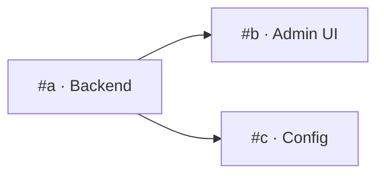

# sl-subtask — one oversized card → an ordered set of PR-sized sub-issues (Searchlight)

> **Base path is `$SL_BASE_PATH`**, defaulting to `/Users/danieljohnston/git/Searchlight` (the workspace container). Repo checkout: `$SL_BASE_PATH/IntegrationService`. If unset, set it first in every shell snippet: `export SL_BASE_PATH="${SL_BASE_PATH:-/Users/danieljohnston/git/Searchlight}"`.

The third front door alongside **`sl-plan`** (issue → reviewed plan, persisted on the card) and **`sl-issue`** (issue → shipped PR). Its single job is **decomposition**: take a card that is too big to build in one pass and turn it into a small, ordered set of children that each fit in one context and one PR.

**Why it exists.** A single `/sl-issue` run on a sprawling card burns a long context, drifts from the requirements somewhere in the middle, and lands a PR nobody can review in one sitting. Sub-issues are also the unit **`/sl-issues` already understands** — it expands native GitHub sub-issues recursively, parent-first, drops closed/assigned ones, and works them one at a time, **merging between items** so each child's base contains the last one's work. That merge-in-between is load-bearing on this codebase: a parent and its children routinely touch the same integration config, the same Flyway chain, and the same acceptance-test class. So a good breakdown here converts directly into `/sl-issues <parent>`, and a bad one (wrong order, hidden dependency, two migrations off the same base) shows up as a stalled queue or a silent version collision.

**It writes no feature code, cuts no branch, boots no env, and opens no PR.** Its only writes are the new subtask issues, their sub-issue links, their board cards, the parent's `epic` label, and one comment on the parent — all behind a single checkbox gate.

> **Model policy.** Cutting the work and ordering it is a **core role → keep it on the strongest available model** (per `IntegrationService/CLAUDE.md`: implement on **Fable**, falling back to **Opus**). A bad seam is expensive — it surfaces three cards later as a card that can't be started. Codebase grounding fans out to fresh `Explore` agents; the breakdown-review gate is a **review role** → fresh, context-isolated subagents mixing **Opus + Sonnet** (the repo's standing "spot-checked by both an Opus and a Sonnet subagent" convention, applied to the *cut* instead of the diff), **adjudicated on Opus**. Never flat-vote a mixed panel.

## Inputs

```
/sl-subtask <issue-number|url> [--dry-run] [--redo] [--min N] [--max N]
```
- An issue URL (`https://github.com/Zangow/IntegrationService/issues/<n>`) **or just an issue number** — `173` or `#173`. A bare number **defaults to `Zangow/IntegrationService`**, where every Searchlight card lives (including cards whose work is actually in the skills repo). If no issue was given, ask for it.
- **`--dry-run`** — propose the breakdown to the terminal only. **No** issues created, **no** links, **no** board moves, **no** label change, **no** comment.
- **`--redo`** — the card already has native sub-issues and you want a fresh breakdown anyway (the first cut was wrong, or scope grew). Without it, an already-split card **stops** at step 1 rather than double-filing.
- **`--min N` / `--max N`** — override the default **3–12** band. Rarely needed; the band is a guardrail, not a target (step 3).

## Board contract (Searchlight Integration Service — Zangow user project #1)
Columns: `Backlog`, `Ready`, `In progress`, `In review`, `Done`. Children **inherit the parent's column** (fallback `Backlog`). **This skill never moves the parent card and never assigns anything** — splitting isn't starting work; `sl-issue` owns the board moves and the assignee when the real work kicks off.

## Pipeline

### 1. Fetch the card and check it's actually splittable
Pull everything that could carry scope — body *and* comments (real acceptance criteria, owner rulings and prior clarifications live in comments on this board):
```bash
gh issue view <n> --repo Zangow/IntegrationService \
  --json number,title,body,labels,assignees,comments,url,state,milestone,createdAt
```
Capture `number`, `url`, `title`, and `labels`. Then check five things **before** cutting anything:

1. **Already split?** — native sub-issues are the source of truth, not a task list in the body:
   ```bash
   gh api repos/Zangow/IntegrationService/issues/<n>/sub_issues \
     --jq '.[] | "\(.number)\t\(.state)\t\(.title)"'
   ```
   If this returns anything and `--redo` wasn't passed, **stop**: print the existing children and their states, and say the card is already broken down (offer `--redo`, or `/sl-issues <n>` to work it). With `--redo`, treat the existing OPEN children as the starting point — extend or re-cut around them, and **never** delete or close a child a human may have started. Say plainly which existing cards you kept.
2. **Is this card itself a sub-issue?**
   ```bash
   gh api graphql -f query='query($owner:String!,$repo:String!,$n:Int!){
     repository(owner:$owner,name:$repo){ issue(number:$n){
       parent{ number title url } subIssuesSummary{ total completed } }}}' \
     -F owner=Zangow -F repo=IntegrationService -F n=<n>
   ```
   A third level is legal (`sl-issues` recurses), but it usually means the *parent's* breakdown was wrong. Flag it and confirm with the user before continuing.
3. **An `sl-plan` plan of record** (`## 🧭 Implementation plan — sl-plan` in the comments; take the **newest** if several). If present it is the richest input this skill gets: its **`### Steps`** are the natural seams, its **requirements checklist** is the coverage contract, its **`### Resolved clarifications`** are settled decisions to carry onto the children verbatim, and its header line already states the **change type / surfaces / migration / deploy / configs-to-republish** footprint each child must inherit. Adopt all of it instead of re-deriving it — but verify its `file:line` anchors still resolve during step 2, and say so if it drifted.
4. **The card's board column** — the children inherit it:
   ```bash
   OWNER="Zangow"; PROJECT_NAME="Searchlight Integration Service"
   URL="https://github.com/Zangow/IntegrationService/issues/<n>"
   PNUM="$(gh project list --owner "$OWNER" --format json \
     --jq ".projects[] | select(.title==\"$PROJECT_NAME\") | .number")"
   gh project item-list "$PNUM" --owner "$OWNER" --format json --limit 5000 \
     --jq "[.items[] | select(.content.url==\"$URL\")] | (.[0].status // \"(not on board)\")"
   ```
5. **The epic it hangs off**, if any (`#1` platform, `#129` raw-capture, `#134` Yelp docs-compliance, `#173` AT pack …). Sibling tickets in the same epic usually set the pattern the children should follow — and sometimes reveal that part of this card is already filed elsewhere.

### 2. Ground the breakdown in the actual codebase  ← before drawing a single line
Fan out fresh **`Explore`** agents (Agent tool, `subagent_type: Explore`, several in **one** message so they run concurrently) — one per plausible surface. Skip surfaces the card obviously doesn't touch:

- **Backend** — `$SL_BASE_PATH/IntegrationService/src/main/java/io/searchlightdigital/integration/` (`api` · `domain` · `mapping` · `hydration` · `polling` · `delivery` · `config`)
- **Schema** — `src/main/resources/db/migration/V*.sql` (Flyway, additive-only, `ddl-auto: validate`) — **always check this one**, if only to learn the next free `V<n>`
- **Admin UI** — `IntegrationService/ui/` (React)
- **Customer embed** — `IntegrationService/ui-embed/` (Lit web component)
- **Infra** — `IntegrationService/infra/` (Terraform; IAM task-role policies live here)
- **Ops / deploy** — `IntegrationService/scripts/`
- **Tests** — `acceptance-tests/`, `e2e/specs/*.spec.ts`, `src/integrationTest/`, `src/test/`
- **Skills** — `$SL_BASE_PATH/.claude/skills/` (a **separate repo**, `Zangow/SearchlightClaude`)

Ask each for what `sl-plan` asks (where this behavior lives today, the **closest existing pattern to copy**, what has to change, what's already there the card may not know about, where the matching tests live — all as `file:line`) **plus the three things this skill specifically needs**:

- **The seams.** Where does this work naturally cut into pieces that can land separately? What is the smallest first change that is useful on its own and doesn't break anything?
- **The real surface list.** Which surfaces does this genuinely touch? Don't infer it from the card's prose, which routinely says "and update the UI" for work that turns out to be one admin form field — or omits the Terraform IAM widening that the S3 write actually requires.
- **Config vs capability, per piece.** For each candidate seam: is it expressible in an integration config against capabilities the deployed backends **already** have (config-only, no deploy), or does it need a new **GENERAL** platform capability first? This fork drives the whole work order (step 4's deploy seams).

Also check whether part of the card is **already done** by a recent commit or PR — this board has a lot of shipped-but-not-closed work. Work that's already landed must not become a subtask; if most of it is done, stop and say so.

### 3. Cut the work — the rules that make a card PR-sized
Decompose on the strongest available model. Every rule below is a constraint on the cut, not a preference:

- **One surface per subtask.** `Backend · Admin UI · Embed · Data · Infra · Ops · Config · Skill` — a card that spans two is a cut error. This is one repo, so the justification isn't the repo boundary (as it is on Driftwise): it's that each surface has its own deploy footprint, its own reviewer, and its own verification path in `sl-verify`.
- **One verification surface per subtask.** If proving the card works needs both an `acceptance-tests/` HTTP+S3 spec **and** a Playwright `e2e/` browser flow, it's two cards.
- **A skill change is a different repo — always its own card.** `.claude/skills/` is `Zangow/SearchlightClaude`, a separate remote with a separate PR. A card that changes both a skill and product code is two cards, even when the skill edit is four lines. (The card itself still gets filed in `Zangow/IntegrationService` — that's where all Searchlight cards live.)
- **PR-sized means one context finishes it.** Rough ceiling per card: **≤ ~8–10 files**, **≤ ~400 changed lines**, one coherent behavior, roughly a day of work. A card that blows past two of these gets split.
- **Capability before config — and mind the deploy in between.** The card that adds a GENERAL platform capability comes before every card that configures against it, because **a config depending on an undeployed capability cannot be published**. Record that as a **deploy seam** in step 4. (This is exactly how #141 shipped a filter that wasn't actually in effect — the capability landed, the configs were never republished.)
- **Contract before consumers.** Endpoint, response shape, DB column, standard-schema field, config key: the card that defines it precedes every card that reads it. That's what makes the serial `/sl-issues` order work — the consumer's base already contains the contract.
- **Flyway: at most one migration-bearing card per breakdown, and the migration ships *with* the code that uses it.** This is the opposite of the Driftwise rule and it matters:
  - Hibernate runs `ddl-auto: validate`, so a schema and the entity that maps it must agree **at boot**. Splitting "add the column" from "map the column" buys nothing and risks a boot failure in the window between them.
  - Migrations are additive-only and a shipped script is never edited.
  - **Two cards cut off the same `main` will each claim the same next `V<n>` and collide silently.** If two migrations are genuinely unavoidable, put them **adjacent** in the line and give the later card a `⚠ Re-check the next free V<n> after #<earlier> merges — do not reuse the number in this card's body` line. Prefer folding them into one card.
  - A large **data backfill** is the one legitimate reason to split a migration onto its own card.
- **IAM ships with the S3/AWS change that needs it — never as a later card.** Any new bucket, prefix, or action (`PutObject`, `DeleteObjectVersion`, `ListBucketVersions` …) needs the Terraform task-role policy widened in the *same* card, or it works locally and AccessDenies in the deployed env only. Splitting here manufactures a broken intermediate state.
- **Main stays green after every merge.** Merging cards 1..k in order must leave `./gradlew check` passing and the service working for every k. Dark-ship or config-gate a half-built surface rather than landing a broken one.
- **Tests ship with their card.** Never a trailing "add tests" subtask. Each card carries its own coverage per `sl-issue`'s policy: **acceptance test by default** (preferably *extending* the spec that already covers the flow — name it), plus the unit/integration layer. A card whose only observable outcome is a **Micrometer counter** is a bad card — there's no exporter, so it can't be verified in QA/PROD; re-cut it around a log line or an API-observable signal, or state the caveat on the card.
- **Coverage is exact.** The union of the subtasks must deliver 100% of the parent's scope, and no two cards may do the same work. Every requirement of the parent (or every row of an adopted `sl-plan` checklist) maps to **exactly one** subtask; anything deliberately dropped goes in the parent comment's *Out of scope*, not into silence.
- **Never split for the sake of the count.** Two files that must change together are one card. A card that reads as "and also" is two.
- **Canonical-schema changes need sign-off, not a subtask.** If any piece would change a published standard schema (the `#5`/`#56`/`#30` class), it does not become a card that someone can just start — flag it in the parent comment as needing owner + ingestion-owner sign-off first, and mark that child `**Blocked on sign-off**` at the top of its body.

**How many.** Aim inside **3–12** (override with `--min`/`--max`):
- **Fewer than 3 genuinely warranted** → say so and **stop**. The card is already PR-sized; hand it to `/sl-issue <n>`. Never manufacture subtasks to hit a number.
- **More than 12** → this is an epic, not a story. Offer the user a choice: **(a) two-level split** — 3–6 phase cards now, each of which can be run through `/sl-subtask` itself later (`sl-issues` recurses, so two levels queue fine), or **(b) cut scope** back on the parent. Don't file 20 flat children.

### 4. Order them, and state the dependencies + deploy seams
Produce a **strictly linear work order**, positions `1..M` — the order `/sl-issues` will walk, one at a time, merging between items. On top of that line, record two things:

- **The real dependency graph** — which cards genuinely block which (`Depends on #x`), versus which are merely sequenced by convenience and could be worked in parallel by a second person.
- **The deploy seams** — the points in the line where a **deploy must land before the next card can be verified or published**. On this codebase that's almost always: capability card → *deploy backend to QA (then PROD)* → config/publish card. Mark them explicitly; they're the difference between a merged PR and a working change, and `/sl-issues` deliberately doesn't deploy.

**Self-check before going further** — if any of these fails, re-cut rather than shipping a line that can't be walked:
- every card's prerequisites appear **earlier** in the line
- no cycles
- every contract- or capability-defining card precedes its consumers
- **position 1 is startable today** against current `origin/main`, with no unmet prerequisite
- merging 1..k in order leaves `./gradlew check` green at every k
- at most one card adds a Flyway migration — or the two are adjacent and the later one carries the re-number warning
- no card depends on a card that was dropped as out of scope
- every deploy seam is on the line, not assumed

### 5. Write each subtask so it stands alone
**Title:** `[<i>/<M>] <Surface> — <imperative task>` where `<Surface>` ∈ `Backend · Admin UI · Embed · Data · Infra · Ops · Config · Skill`. The `<i>/<M>` prefix keeps the work order visible on the board card, where the sub-issue nesting isn't.

**Body template** — a fresh `/sl-issue` context reads **only this card** plus the repo. Never write "see the parent": duplicate the two or three lines of context it needs.

```markdown
Part <i> of <M> of #<parent> — <parent title>.

**Surface:** <Backend | Admin UI | Embed | Data | Infra | Ops | Config | Skill> ·
**Repo:** <Zangow/IntegrationService | Zangow/SearchlightClaude> ·
**Depends on:** #<a>, #<b> *(or "nothing — this is the first card")* ·
**Blocks:** #<c>

**Change type:** <config-only | platform capability (GENERAL) | both> ·
**Flyway migration:** <yes — V<n>__<name>.sql, additive | no> ·
**Deploy needed:** <none | backend QA+PROD | UI | embed | infra/Terraform> ·
**Live configs to republish:** <slug(s) + envs | none>

## Goal
<2–3 sentences: what is true when this card is done, in the user's terms. Enough parent
context to work it cold.>

## Scope
**In:** <the specific behavior this card delivers>
**Out:** <what a reader might assume is here but isn't — name the sibling card that owns it>

## Where it lives
- `IntegrationService/<path>:<line>` — <what changes>
- Closest existing pattern to follow: `IntegrationService/<path>:<line>`

## Requirements
| # | Requirement (observable outcome) | Surface |
|---|----------------------------------|---------|
| R1 | <what must be true when done — observable, not an implementation step> | backend/ui/embed/infra/config |

## Tests
<Named test per testable requirement, at the level `sl-issue`'s policy calls for: acceptance test
by default — say whether you're extending an existing spec and which (`acceptance-tests/` for
API/delivery, `e2e/specs/*.spec.ts` for admin-UI/embed flows) — plus the unit/integration layer.
Note that `:acceptance-tests:acceptanceTest` sits outside `./gradlew check`, so say how the new AT
actually gets run (`scripts/run-acceptance.sh local` against a booted stack).>

## Done when
- [ ] <the observable outcome a human can check>
- [ ] `./gradlew check` green with only cards 1..<i> merged

---
> Broken out by `/sl-subtask` from #<parent> on <YYYY-MM-DD>. Work the set in order with
> `/sl-issues <parent>` — or this card alone with `/sl-issue <this>`.
> PRs reference the issue with `Refs #<this>` and never `Closes` — issues are closed manually.
```

### 6. Breakdown-review gate  ← before anything is filed
A breakdown nobody checked is worse than none, because the queue trusts it. Run it past fresh, **context-isolated** reviewers — they get the parent issue, the step-2 grounding, and the **proposed breakdown**, never your reasoning for it. Scale the panel to size (a 3-card split doesn't need three reviewers):

- **1× `general-purpose`, `model: opus`** — *coverage*: does the union of these cards deliver the whole parent? What fell **between** two cards? Is any card too big for one context or one reviewable PR?
- **1–2× `general-purpose`, `model: sonnet`** — cheap decorrelated breadth: ordering and dependency errors, a card that secretly spans two surfaces, duplicated work across cards, missed empty/error/credential-expiry/rate-limit work, a card that can't actually start where the line says it can.

Give each a distinct lens where you can — coverage & traceability · ordering, migrations and deploy seams · integration-contract and live-data blast radius.

**Adjudicate on Opus** — Sonnet nominates, Opus decides. Fold real blockers into the cut and re-run the step-4 self-check if the order moved.

**Escalate the panel** when the breakdown touches a Flyway migration, already-delivered S3 data (remap/purge/redaction/versioning), a published contract or standard schema, credentials/PII, or IAM. Those are the cuts that are expensive to unwind.

Note in the parent comment that the per-card **plan review still has to happen** — `/sl-plan` or `/sl-issue`'s own gate on each child. This breakdown reviewed the *cut*, not the method.

### 7. Present it + one checkbox gate  ← the only pause
Print the breakdown to the terminal as a checkbox table — **everything checked by default** — plus the dependency graph and the deploy seams:

```
☑ 1. [1/5] Backend — add GENERAL dailyCost transform + V19 migration  · deps: none · ~7 files
     ↓ deploy backend QA+PROD before card 3 can publish
☑ 2. [2/5] Admin UI — surface the cost column on the delivery page    · deps: 1    · ~4 files
☑ 3. [3/5] Config  — republish yelp-leads carrying dailyCost (QA+PROD)· deps: 1    · config-only
…
```
Each row: position, title, surface, dependencies, rough size, and **why it's a separate card** (that last column is what the user is really reviewing). Flag any card blocked on sign-off, any migration-bearing card, and list anything deliberately left **out of scope**.

Then resolve the whole thing in **one** `AskUserQuestion` round: which cards to **drop**, any pair to **merge**, any card to **split further**, and confirmation to file. Re-cut and re-present if the answers change the shape materially (a merge that puts two surfaces or two migrations on one card is refused — say why and offer the alternative). **Nothing is created before this gate.** On `--dry-run`, stop here and print where the breakdown would have gone.

Write the rendered breakdown, and each child's body, to a stable **non-repo** path (alongside `.sl-plan/` and `.sl-issue/`) so nothing lands in the repo's history and the work survives the session:
```bash
mkdir -p "${SL_REAL_BASE:-$SL_BASE_PATH}/.sl-subtask"
# ${SL_REAL_BASE:-$SL_BASE_PATH}/.sl-subtask/BREAKDOWN-<n>.md
# ${SL_REAL_BASE:-$SL_BASE_PATH}/.sl-subtask/subtask-<n>-<i>.md   ← one per child, for step 8
```

### 8. File the subtasks — in work order
Create them **strictly in order** so the sub-issue list and the board order match the line. Per card:

```bash
export SL_BASE_PATH="${SL_BASE_PATH:-/Users/danieljohnston/git/Searchlight}"
REPO="Zangow/IntegrationService"        # every Searchlight card lives here
PARENT=<n>
MOVE="${SL_REAL_BASE:-$SL_BASE_PATH}/.claude/skills/_shared/sl-move-issue-column.sh"

# 1. create the card (labels inherited + the surface label; NEVER an assignee)
CHILD_URL=$(gh issue create --repo "$REPO" \
  --title "[<i>/<M>] <Surface> — <task>" \
  --label "<inherited,labels>" \
  --body-file "${SL_REAL_BASE:-$SL_BASE_PATH}/.sl-subtask/subtask-<n>-<i>.md")
CHILD=${CHILD_URL##*/}

# 2. link it as a NATIVE sub-issue of the parent (this is what /sl-issues expands)
CHILD_ID=$(gh api "repos/$REPO/issues/$CHILD" --jq .id)     # database id, not the node id
gh api --method POST "repos/$REPO/issues/$PARENT/sub_issues" -F sub_issue_id="$CHILD_ID"

# 3. board it in the parent's column (fallback: Backlog)
"$MOVE" "$REPO" "$CHILD" "<parent's column>"
```

- **Labels** — inherit the parent's minus `epic`, keep `bug` vs `enhancement` as the parent has it, and add the surface label: `backend` · `frontend` (admin UI **and** embed) · `infra` · `skill` · `testing` · `documentation`.
- **Never assign a subtask.** `/sl-issues` drops any assigned card as "already picked up", so an assignee silently removes it from the queue.
- **Create succeeded but link failed?** Never re-run the create. Retry the link, or fall back to GraphQL, then report any card left unlinked:
  ```bash
  gh api graphql -f query='mutation($p:ID!,$c:ID!){addSubIssue(input:{issueId:$p,subIssueId:$c}){clientMutationId}}' \
    -F p=<parent node id> -F c=<child node id>
  ```
- **Order drifted?** Re-seat a child with `PATCH repos/Zangow/IntegrationService/issues/<parent>/sub_issues/priority` (`-F sub_issue_id=<id> -F after_id=<id>`).
- Board moves and label adds are **conveniences, not gates** — if one fails (usually gh scopes: `gh auth refresh -s read:project,project`), surface it and keep going.

### 9. Update the parent card
Two writes, both idempotent. **The human's description is never edited.**

**a. Label the parent `epic`** ("Parent tracking issue") so the board shows at a glance that this card is a container, not a unit of work — and so `/sl-issues` treats it as an umbrella parent to drop from the queue:
```bash
gh issue edit <n> --repo Zangow/IntegrationService --add-label epic
```
Leave the title alone — this board uses the label, not a title prefix.

**b. Post the work order + dependency graph as a comment** (`gh issue comment <n> --repo Zangow/IntegrationService --body-file …`):

````markdown
## 🧩 Subtask breakdown — sl-subtask <YYYY-MM-DD>

Broken into <M> cards. **Work them in this order, one at a time, merging between items** —
`/sl-issues <n>` does exactly that (it expands these sub-issues parent-first and queues them).
This parent is an **umbrella**: it carries no work of its own — drop it from the queue.

| # | Card | Surface | Depends on | Deploy / configs | Notes |
|---|------|---------|-----------|------------------|-------|
| 1 | #<a> [1/M] Backend — … | backend | — | backend QA+PROD | GENERAL capability; adds V19 (additive) |
| 2 | #<b> [2/M] Admin UI — … | ui | #<a> | UI | |
| 3 | #<c> [3/M] Config — … | config | #<a> + deploy | republish `yelp-leads` QA+PROD | config-only |

### Dependencies

`#<b>` and `#<c>` only depend on `#<a>` — they can go in parallel if two people pick them up;
the linear order above is what a single serial run should follow.

### Deploy seams
- After **#<a>** merges, the backend must be deployed (`/sl-deploy`, QA then PROD) **before**
  **#<c>** can publish its config — a config depending on an undeployed capability can't go live.

### Ops footprint (combined)
- **Flyway:** <V<n>__<name>.sql on #<a>, additive | none>
- **Deploys:** <backend QA+PROD · UI · embed · Terraform | none>
- **Live configs to republish:** <slug + env, per card | none>

### Notes
- **Out of scope of this breakdown:** <anything deliberately not covered by any child>
- **Blocked on sign-off:** <cards touching the published standard schema, or "none">
- **Still to run per child:** each card goes through the usual `/sl-plan` → `/sl-issue` gates.
  This breakdown reviewed the **cut**, not the method — no per-card plan review has happened yet.
````

**Re-running (`--redo`)**: post a new comment that opens with `> Revises the breakdown in <comment-url> — <one line on what changed>`. Never delete or overwrite a prior breakdown comment, and never close a child a human may have started.

## Output
Report: the parent title + URL + board column; the **breakdown table** (position, `#`, title, surface, dependencies, deploy/config footprint, size); the **dependency graph** and the **deploy seams**; which cards were dropped, merged, or split at the gate; anything left **out of scope**; the **review panel's outcome** (blockers folded in, concerns accepted, which models reviewed); whether an `sl-plan` plan of record was adopted as the seam source; the parent's `epic` label; the local path to `BREAKDOWN-<n>.md`; and any card that failed to link or board. Close with the next step: `/sl-issues <parent>` to work the whole set in order, `/sl-issue <first-child>` for just the first, or `/sl-plan <child>` on any child that needs its own thinking first.

## Guardrails & notes
- **Decomposition only.** No feature code, no branch, no worktree, no env boot, no PR. Its writes are the children, their links and cards, the parent's `epic` label, and one comment — all behind the step-7 gate.
- **Surfaces never share a card**, and a **skill change is always its own card** (different repo, `Zangow/SearchlightClaude`). One repo doesn't mean one card.
- **At most one Flyway migration per breakdown**, shipped with the code that uses it (`ddl-auto: validate`). Two migrations off the same `main` collide on `V<n>` silently — the reason `/sl-issues` merges between items.
- **IAM never trails.** Terraform task-role widening ships in the same card as the S3/AWS change that needs it, or the card passes locally and AccessDenies in the deployed env.
- **Capability ≠ live.** Shipping a capability doesn't apply it — name the deploy seam and the configs to republish, or the breakdown reproduces the #141 failure.
- **The order must be walkable one at a time.** Position 1 startable today, no forward references, `./gradlew check` green after every merge. If the line can't satisfy that, the cut is wrong.
- **Never manufacture subtasks.** Under 3 warranted → say the card is already PR-sized and stop. Over 12 → propose a two-level split or a scope cut instead of 20 flat children.
- **Each child stands alone.** A fresh `/sl-issue` context reads only that card — repeat the parent context it needs instead of pointing at the parent.
- **Never assign a child** (it would be dropped from the `/sl-issues` queue), and never close or delete an existing child on `--redo`.
- **Idempotent by default.** An already-split card stops rather than double-filing; the `epic` label is never duplicated; the breakdown comment is revised, not overwritten.
- **All Searchlight cards live in `Zangow/IntegrationService`** — including cards whose work is in the skills repo. The child's body names the real repo; the card still lives here.
- **No CI.** There are no `.github/workflows` — "green" means `./gradlew check` run locally and recorded on the PR. Never plan a CI job into a child.

## Related
- `sl-issues` — the queue driver that works this breakdown: expands the native sub-issues parent-first, drops closed/assigned ones, and runs them one at a time with a merge in between. The intended pairing: `/sl-subtask <n>` → `/sl-issues <n>`.
- `sl-plan` — plans a single card. Run it *before* `/sl-subtask` on a fuzzy card (its steps become the seams and its clarifications carry onto the children), or *after* on any child that needs its own thinking.
- `sl-issue` — builds one child end to end.
- `sl-create-integration` — for "onboard platform X" children, which are config-authoring runs rather than code changes.
- `sl-deploy` — the rollout that fills the deploy seams between cards; `/sl-issues` deliberately doesn't deploy.
